# Omarchy Vault

Turn unused storage in your Omarchy machine into a private cloud for your home Wi-Fi.

**Press a shortcut. Scan the QR code. Done.**

> Beam moves it.
> Vault keeps it.

Omarchy Vault keeps Omarchy as your operating system and adds the useful parts of a NAS on top: one place for your files, a file browser, and QR-code transfer to and from your phone.

**Local only.** Everything happens on your own Wi-Fi. There is no cloud service, no tunnel, no VPN and no port opened on your router.

**Only runs when you need it.** Vault never starts at login or boot. Pressing a shortcut turns it on, and it turns itself off again after 15 minutes with nothing to do.

It is **not** a replacement for TrueNAS, Unraid or ZimaOS. Vault uses the drives you already have, as they are, and hides the Linux plumbing (mounts, SFTPGo, systemd, permissions) behind simple actions.

| You do | Vault handles |
|---|---|
| Pick a drive or folder in setup | safe adoption, system disk protection |
| Press Super+Shift+U | a short-lived upload-only link and a QR code |
| Press Super+Shift+D, pick a file | a short-lived download link and a QR code |
| Create a user for family | SFTPGo accounts, folders, permissions |

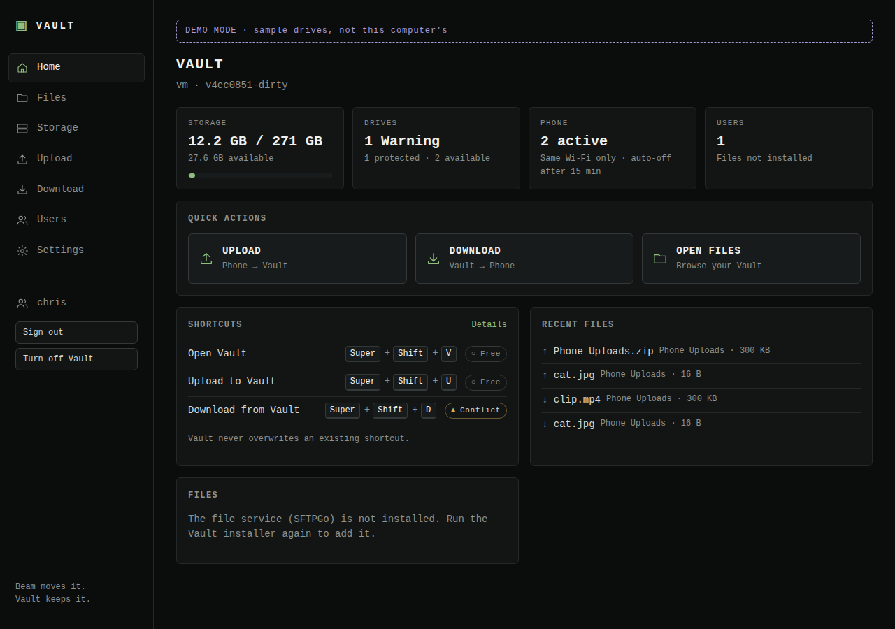

## Status

**Milestones 1–5 of 6 are complete.** Vault protects your system disk, turns a mounted drive into your Vault, gives everyone in the house their own account and a file browser, and moves photos, videos and files between your phone and the Vault with a QR code, both ways. See [ROADMAP.md](ROADMAP.md).

| Works now | Coming |
|---|---|
| **Upload to Vault**: Super+Shift+U, scan the QR code, send photos/videos/files from your phone (M4) | Combining several drives, drive health alerts (M6) |
| **Download from Vault**: Super+Shift+D, pick a file or folder, scan, it downloads to your phone (M5) | |
| **Share links** on your Wi-Fi: read only, up to 24 hours, download limits, optional password (M5) | |
| Turns itself off after 15 minutes with nothing to do | |
| First-run setup: choose a drive, create your admin account | |
| **Files** in the browser: browse, upload, download, folders (M3) | |
| **Users**: Admin / Family / Guest, per-folder read & write or read only (M3) | |
| Sign-in with lockout, optional two-factor (TOTP) (M3) | |
| Your Vault at `/srv/vault`; unplugged drives never fill the system disk (M2) | |
| Drive discovery, SYSTEM · PROTECTED detection, SMART health (M1) | |
| Keyboard shortcuts installed only with your OK, never over an existing one (M4) | |

**New here? Follow the [setup guide](docs/setup-guide.md)**: preparing a drive, installing, first-run, Files and users, step by step.

## Features (v0.1)

- **Storage**: use one drive or a folder on it (combining several drives comes in M6). Existing filesystems only; nothing is formatted.
- **Upload to Vault** (`Super + Shift + U`): scan a QR code with your phone, pick photos, videos or files. They land in `Phone Uploads`.
- **Download from Vault** (`Super + Shift + D`): pick a file or folder, scan the QR code, it downloads to your phone.
- **Share links**: read only, on your Wi-Fi, up to 24 hours, optional password, stop any time.
- **Files**: browse, upload and download in the browser on this computer.
- **Users**: Admin, Family, Guest; read/write or read-only per folder.
- **Drive health**: SMART status, temperature, power-on hours, reallocated sectors. Errors are never hidden.
- **Light**: nothing runs until you use it; it turns itself off after 15 idle minutes.

## Quick start

**One command** (Omarchy / Arch). Plug in your drive and click it in the Files app sidebar so it's mounted, then paste this into a terminal:

```sh
sudo pacman -S --needed git && { git -C ~/Omarchy-Vault pull --ff-only 2>/dev/null || git clone https://github.com/TouchWorkStation/Omarchy-Vault.git ~/Omarchy-Vault; } && ~/Omarchy-Vault/scripts/install.sh --express
```

It installs what it needs, builds Vault, allows phones on your home network to reach it (port 8790, your network only), adds Super+Shift+V/U/D (only if free) and opens the setup screen: pick your drive, create your account, done. It asks for your password for `sudo` a couple of times. Add `--with-files` to also build the Files browser.

Prefer to go step by step?

```sh
git clone https://github.com/TouchWorkStation/Omarchy-Vault.git ~/Omarchy-Vault
cd ~/Omarchy-Vault
./scripts/install.sh --dry-run   # see exactly what will happen
./scripts/install.sh             # asks before each optional step
vaultctl setup                   # turns Vault on, then choose your drive and create your account
vaultctl shortcuts install       # Super+Shift+V/U/D, only the free ones
```

Vault **only runs when you turn it on**. Nothing starts at login or boot.

```sh
vaultctl on                      # turn on
vaultctl off                     # turn off (stops Files too)
vaultctl open                    # open the dashboard, signed in (turns Vault on if needed)
vaultctl users                   # list accounts; `vaultctl users add ann --role family`
vaultctl storage                 # your Vault drive and drives you could use
vaultctl doctor                  # check everything
```

Try it without installing, on any Linux machine:

```sh
make all
./bin/vaultd --demo    # sample drives in a throwaway sandbox, clearly labelled
```

Developing? See [docs/development.md](docs/development.md).

## Architecture

```
 browser / phone ──► vaultd (Go, 127.0.0.1:8788) ──► read-only system tools
                       │  REST API + embedded React UI    lsblk · findmnt · smartctl · hyprctl
                       │
 vaultctl (CLI) ───────┤  SFTPGo (Files, per-user folders) · later: mergerfs (pooling)
 Omarchy plugin (QML) ─┘  phone listener (LAN, port 8790, only while a QR code is active)
```

One Go binary serves the API and the dashboard, and supervises SFTPGo (the file engine) as a child process on 127.0.0.1:8789, reachable only through Vault's sign-in at `/files/`. SQLite holds hashed link tokens and transfer activity, never files. Details: [ARCHITECTURE.md](ARCHITECTURE.md).

## Safety model

- **Vault never formats, partitions, erases or rewrites partition tables.** It only uses filesystems that are already mounted.
- **The system disk is always protected.** Any drive backing `/`, `/boot`, EFI, `/usr`, `/var`, `/home` or swap is marked SYSTEM · PROTECTED. If Vault cannot identify the system disk, it offers no drive at all.
- **Unplugged drives can't fill your system disk.** Vault checks the drive's UUID and the kernel mount table before every use. If the drive is gone, the Vault shows as offline instead of writing into an empty folder.
- **Adopting a drive only adds folders.** Existing files are never moved, renamed or deleted. "Stop using this drive" only forgets it.
- **Accounts done carefully.** Passwords are argon2id hashes, sign-in locks out after repeated failures, two-factor is optional, and disabling someone signs them out immediately. Family and guests only see the folders you give them.
- **Local only.** The dashboard binds to `127.0.0.1` and rejects unknown `Host` headers (DNS-rebinding protection). Phones reach only a separate transfer port on your Wi-Fi, and only while a QR code or share link is active. No tunnel, no VPN, no router ports. SFTP and WebDAV are off.
- **Short-lived.** Vault runs only after you turn it on, and turns itself off after 15 minutes with nothing to do (`auto_off_minutes`).
- **No shell from the web.** There is no command-execution endpoint. Vault runs a short allowlist of read-only tools, without a shell.
- **Shortcuts are never overwritten.** Conflicts are reported with options: choose another, copy the binding, or skip.

Full threat model: [SECURITY.md](SECURITY.md).

## Beam and Vault

Beam and Vault are separate projects. Vault does not depend on Beam and does not modify it. Beam can ask Vault for upload sessions, download sessions and share links (`POST /api/v1/beam/…`, [docs/api.md](docs/api.md)).

## Screenshots

| Upload to Vault: scan and watch files arrive | On the phone |
|---|---|
| 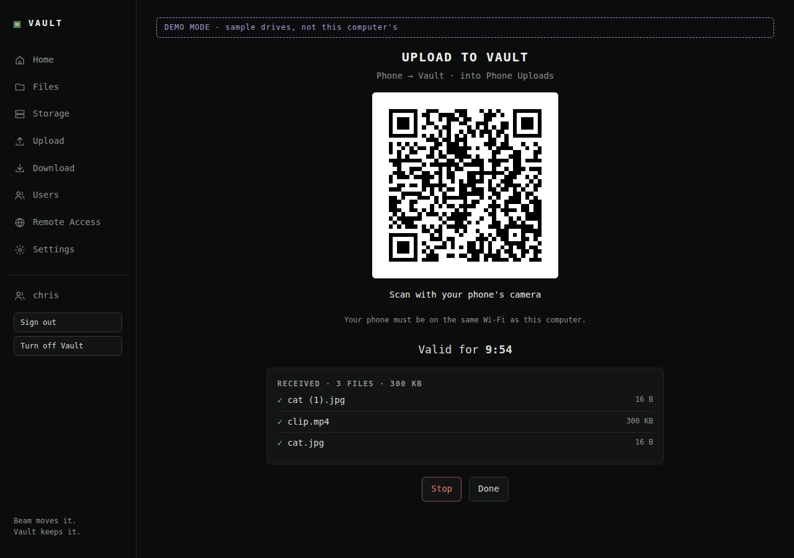 | 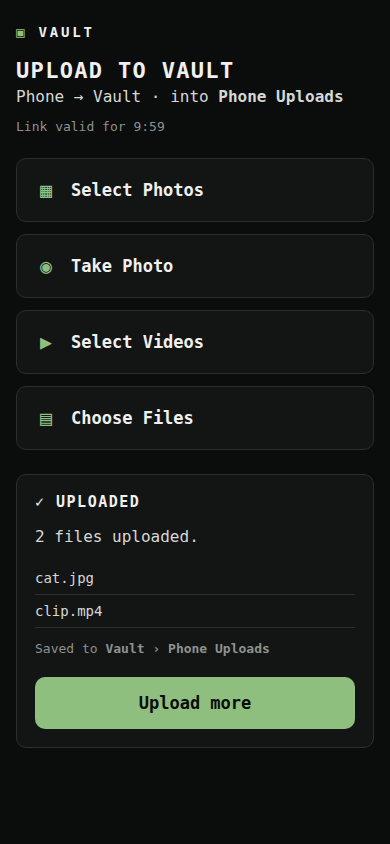 |

| Download from Vault: pick a file or folder | A shared folder on the phone |
|---|---|
| 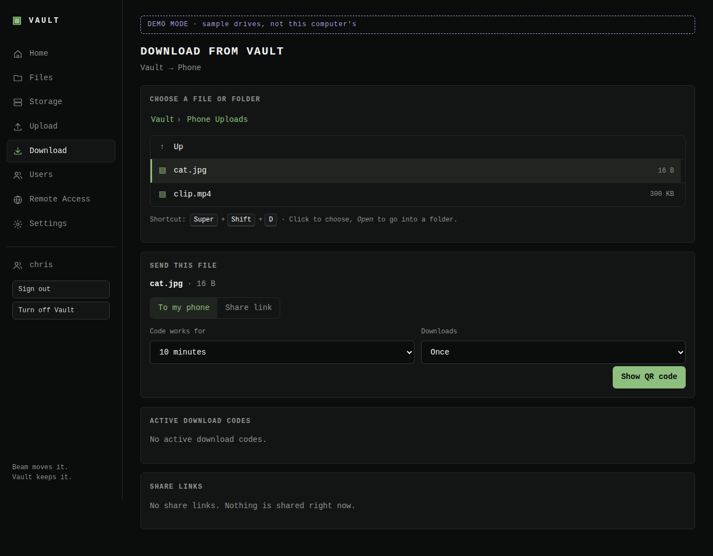 | 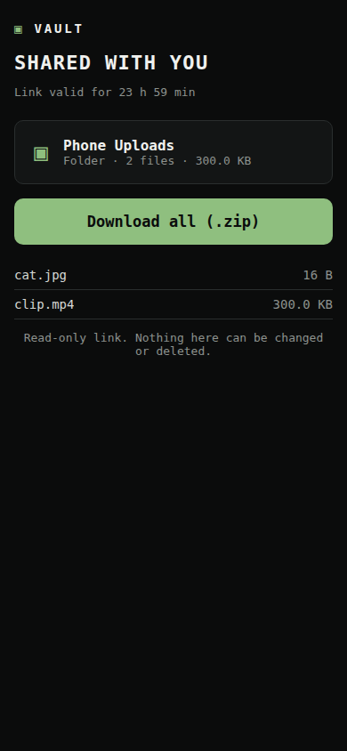 |

| Setup: choose a drive | Setup: create your Vault |
|---|---|
| 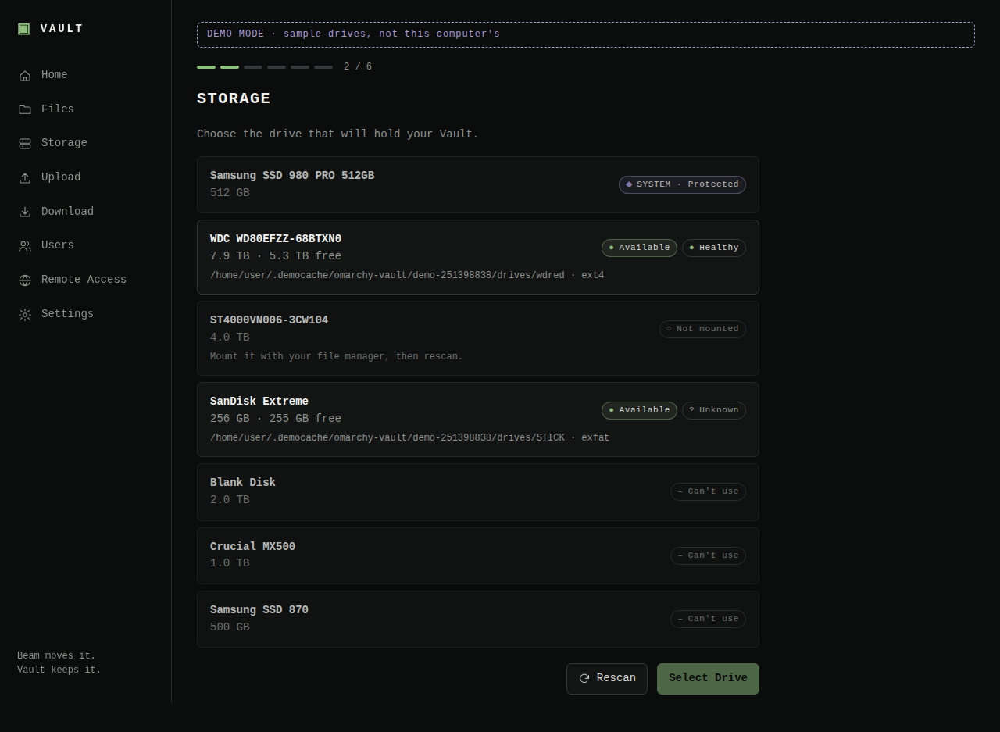 | 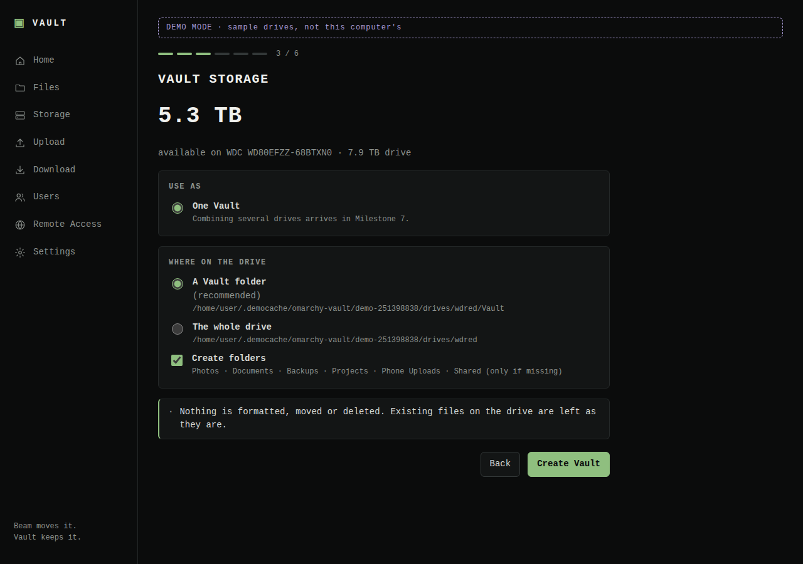 |

| Users | Files (a family member's view) |
|---|---|
| 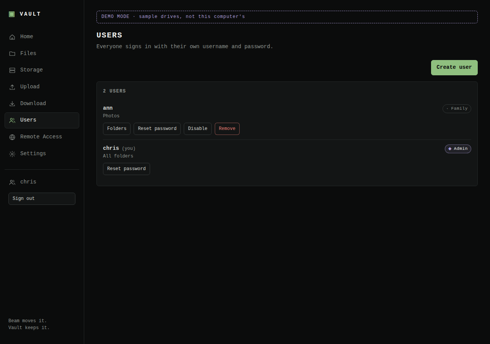 | 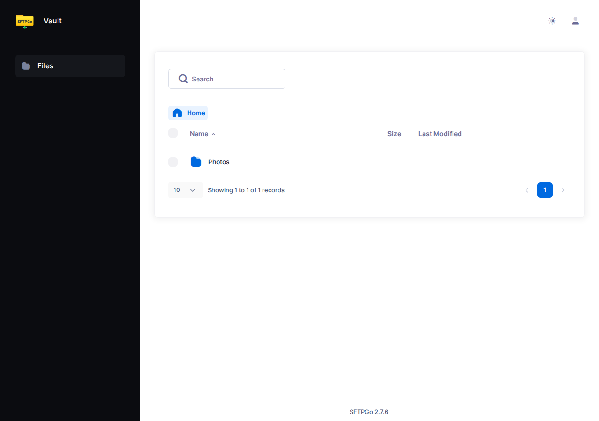 |

| Storage | Phone |
|---|---|
| 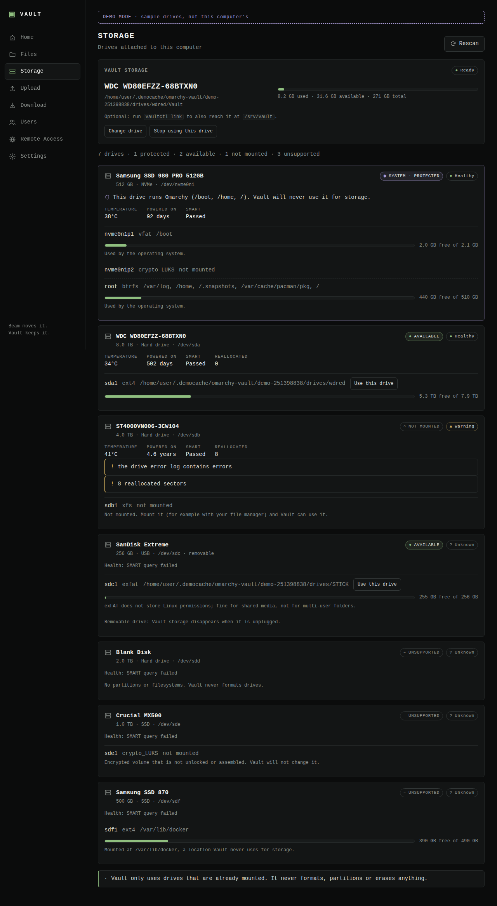 | 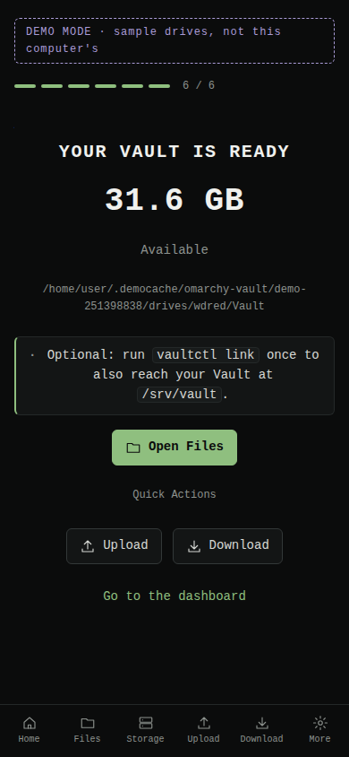 |

Screenshots use `--demo` data.

## Roadmap

1. ✅ Foundation: dashboard, read-only drive discovery, shortcut planning
2. ✅ Single-drive Vault, config, `/srv/vault`, system disk protection
3. ✅ SFTPGo files and users
4. ✅ Upload to Vault (Super+Shift+U), QR, mobile upload page
5. ✅ Download from Vault (Super+Shift+D), file picker, mobile download page, share links
6. Combining drives with mergerfs, SMART monitoring, optional LAN sharing

Not planned: remote access from outside your home (Cloudflare, VPN) and automatic backups. Vault is deliberately local and short-lived.

Details in [ROADMAP.md](ROADMAP.md).

## License

MIT. See [LICENSE](LICENSE).
