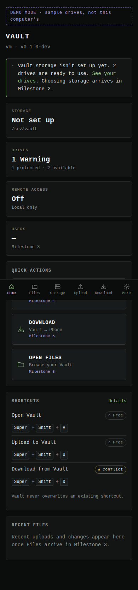

# Omarchy Vault

Turn unused storage in your Omarchy machine into a secure private cloud.

**Upload. Download. Backup. Anywhere.**

> Beam moves it.
> Vault keeps it.

Omarchy Vault keeps Omarchy as your operating system and adds the useful parts of a NAS on top: one place for your files, access from any browser, QR-code transfer to and from your phone, backups, secure share links, and optional remote access through your own domain.

It is **not** a replacement for TrueNAS, Unraid or ZimaOS. There is no separate NAS OS to install, and no RAID to configure. Vault uses the drives you already have, as they are, and hides the Linux plumbing (mounts, mergerfs, SFTPGo, Cloudflare Tunnel, systemd, permissions) behind simple actions.

| You do | Vault handles |
|---|---|
| Combine these drives into one Vault | mergerfs pool, non-destructive |
| Create user | SFTPGo accounts, folders, permissions |
| Connect your domain | cloudflared tunnel, TLS, service |
| Upload to Vault | a short-lived, upload-only link and a QR code |


## Status

**Milestone 1 of 7 is complete.** This build is read-only: it discovers your drives, protects the system disk, shows health, and checks shortcut conflicts. It does not change anything on your machine yet. See [ROADMAP.md](ROADMAP.md).

| Works now (M1) | Coming |
|---|---|
| Dashboard (desktop and phone) | Choosing drives for the Vault (M2) |
| Read-only drive discovery (`lsblk`, `findmnt`) | File browser and users via SFTPGo (M3) |
| SYSTEM / PROTECTED system-disk detection | **Upload to Vault**: Super+Shift+U, QR code (M4) |
| SMART health: Healthy / Warning / Critical / Unknown | **Download from Vault**: Super+Shift+D, QR code (M5) |
| Shortcut conflict detection (never installs) | Remote access through Cloudflare Tunnel (M6) |
| `vaultctl` status, disks, storage, shortcuts, doctor | Combining several drives, LAN sharing (M7) |

## Features (planned for v0.1)

- **Storage**: use one drive, or combine several into one Vault. Existing filesystems only; nothing is formatted.
- **Files**: browse, upload and download from any browser. SFTP/WebDAV for power users (off by default).
- **Upload to Vault** (`Super + Shift + U`): scan a QR code with your phone, pick photos, videos or files. They land in `Phone Uploads`.
- **Download from Vault** (`Super + Shift + D`): pick a file or folder, scan the QR code, it downloads to your phone.
- **Share links**: read-only, expiring, optionally password-protected, revocable.
- **Users**: Admin, Family, Guest; read/write or read-only per folder.
- **Remote access**: your own domain through Cloudflare Tunnel. Vault is never exposed directly.
- **Backups**: copy computer folders into `Backups/<hostname>/` with rsync.
- **Drive health**: SMART status, temperature, power-on hours, reallocated sectors. Errors are never hidden.

## Quick start

Requirements: Omarchy or Arch Linux, `go` ≥ 1.24 and `npm` to build, `util-linux` (preinstalled). Optional: `smartmontools` for drive health.

```sh
git clone https://github.com/TouchWorkStation/Omarchy-Vault.git
cd Omarchy-Vault

./scripts/install.sh --dry-run   # see exactly what will happen
./scripts/install.sh             # build, install for your user, start the service
```

Then open http://127.0.0.1:8788, or run:

```sh
vaultctl doctor      # check everything Vault needs
vaultctl disks       # list drives; the system disk is marked SYSTEM · PROTECTED
vaultctl shortcuts   # check Super+Shift+V/U/D for conflicts
```

Try it without installing, on any Linux machine:

```sh
make all
./bin/vaultd --demo    # sample drives and shortcuts, clearly labelled
```

Developing? See [docs/development.md](docs/development.md).

## Architecture

```
 browser / phone ──► vaultd (Go, 127.0.0.1:8788) ──► read-only system tools
                       │  REST API + embedded React UI    lsblk · findmnt · smartctl · hyprctl
                       │
 vaultctl (CLI) ───────┤  later: SFTPGo (files, users) · mergerfs (pooling)
 Omarchy plugin (QML) ─┘         cloudflared (remote) · privileged helper (narrow, allowlisted)
```

One Go binary serves the API and the dashboard. SQLite (from Milestone 4) holds tokens, shares and activity, never files. Details: [ARCHITECTURE.md](ARCHITECTURE.md).

## Safety model

- **Vault never formats, partitions, erases or rewrites partition tables.** It only uses filesystems that are already mounted.
- **The system disk is always protected.** Any drive backing `/`, `/boot`, EFI, `/usr`, `/var`, `/home` or swap is marked SYSTEM · PROTECTED. If Vault cannot identify the system disk, it offers no drive at all.
- **Local by default.** The service binds to `127.0.0.1` and rejects unknown `Host` headers (DNS-rebinding protection). Remote access is opt-in and goes through a tunnel.
- **No shell from the web.** There is no command-execution endpoint. Vault runs a short allowlist of read-only tools, without a shell.
- **Shortcuts are never overwritten.** Conflicts are reported with options: choose another, copy the binding, or skip.

Full threat model: [SECURITY.md](SECURITY.md).

## Beam and Vault

Beam and Vault are separate projects. Vault does not depend on Beam and does not modify it. Vault reserves `POST /api/v1/beam/*` endpoints so Beam can later ask Vault for upload sessions, download sessions and shares ([docs/api.md](docs/api.md)).

## Screenshots

| Storage | Phone |
|---|---|
|  |  |

Screenshots use `--demo` data.

## Roadmap

1. ✅ Foundation: dashboard, read-only drive discovery, shortcut planning
2. Single-drive Vault, config, `/srv/vault`, system disk protection
3. SFTPGo files and users
4. Upload to Vault (Super+Shift+U), QR, mobile upload page
5. Download from Vault (Super+Shift+D), file picker, mobile download page
6. Remote access through Cloudflare Tunnel
7. Combining drives with mergerfs, SMART monitoring, optional LAN sharing

Details in [ROADMAP.md](ROADMAP.md).

## License

MIT. See [LICENSE](LICENSE).
